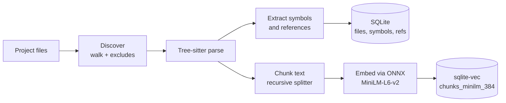
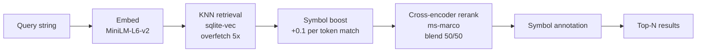
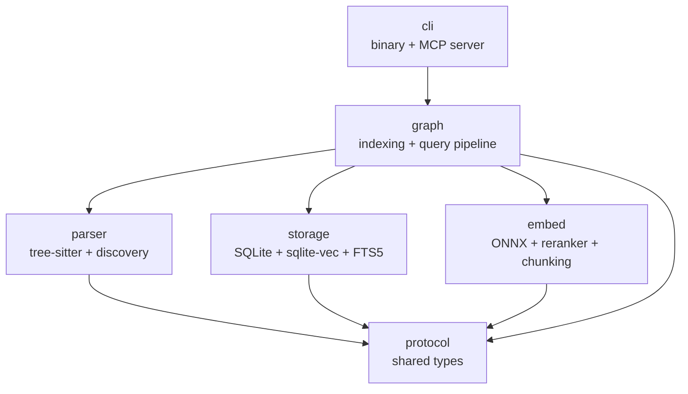

# CodeSage

[](https://github.com/iliaal/codesage/actions/workflows/ci.yml)
[](https://github.com/iliaal/codesage/actions/workflows/tests.yml)
[](https://github.com/iliaal/codesage/actions/workflows/secret-scan.yml)
[](https://github.com/iliaal/codesage/releases)
[](https://opensource.org/licenses/MIT)
[](https://x.com/intent/follow?screen_name=iliaa)

CodeSage is a code intelligence engine for AI coding agents. It combines structural graph queries (symbols, references, dependencies) and semantic search (embedding retrieval with cross-encoder reranking) in a single Rust binary, usable as a CLI or over MCP.

## What you can do with it

- Find code by natural-language query: "where does auth happen?", "error handling in the GC".
- Look up symbol definitions by name across a codebase.
- Trace imports, calls, and inheritance for any symbol.
- Map import and include relationships between files.
- Estimate which files a change breaks (change impact analysis).
- Build curated code bundles for LLM consumption in JSON, markdown, or flat-text (gitingest-style) form.
- Read per-file git history: churn, fix ratio, historical co-change, risk score.
- Expose all of the above over MCP so Claude Code, Codex, or Cursor can call them.

## Supported languages

PHP, Python, C, C++, Rust, JavaScript, TypeScript, Go.

## Why a single Rust binary

CodeSage ships as one static Rust binary plus a local SQLite database under `.codesage/` per project. No Docker container, no external vector DB server, no embedding service, no daemon. On first use it downloads the embedding and reranker ONNX models (~500 MB combined) and reuses the Hugging Face cache forever after.

The trade-off: CUDA-accelerated embeddings need the `nvidia-*-cu12` pip packages on the host (see [CUDA setup](#cuda-setup) below). In exchange, install once, run everywhere, no orchestration layer, no systemd unit to manage. Tools in the same category that take the other side of this trade (SocratiCode with managed Qdrant + Ollama, GitNexus with external Qdrant) are valid for different user profiles. If your team already runs Docker Compose for everything, use those. If you want `cargo install` and `codesage init` and nothing else to debug, use CodeSage.

## Benchmarks

Ground-truth retrieval on git-mined corpora, 30 cases per repo, `search` top-10:

| repo | miss rate | mean recall@10 |
|---|---:|---:|
| BurntSushi/ripgrep @ `4519153e5e46` (101 files, 52K LoC) | 13% | 0.79 |
| nestjs/nest @ `8eec029772fa` (1,672 files, 110K LoC) | 3% | 0.94 |

Head-to-head against code-review-graph 2.3.2 (same corpora, same queries, code-review-graph configured with matching test-directory exclusions for fairness):

| repo | CodeSage miss | code-review-graph miss | CodeSage per-query wall-clock | code-review-graph per-query wall-clock |
|---|---:|---:|---:|---:|
| ripgrep | **13%** | 17% | ~0.25 s | 0.80 s |
| nest | **3%** | 40% | ~0.25 s | 1.10 s |

The nest gap is architectural: CodeSage embeds chunks (~50-line regions), code-review-graph embeds nodes (functions). Commit-style queries that describe behavior spanning multiple functions match chunks more reliably than individual function bodies.

Run yourself with `bench/codesage-bench-runner <corpus.yaml>` (corpus format: `project_root` + `cases` list of `{id, query, expected_files}`). Scorecards from these runs live under `bench/history/`; corpora are not bundled so private-repo names don't leak by accident. Not a statement about every workload; bring your own corpus for your codebase.

## Getting started

```bash
# Build with GPU support
cargo build --release -p codesage --features cuda

# Initialize and index a project
cd /path/to/your/project
codesage init
codesage index

# Search
codesage search "authentication handler"
codesage search --json --limit 20 "database connection pooling"

# Structural queries
codesage find-symbol MyClass
codesage find-references some_function --kind call
codesage dependencies src/main.py

# Change impact analysis (who breaks if you touch this?)
codesage impact DocumentRepository --depth 2 --source-only
codesage impact src/auth/session.ts --json

# Context bundle for LLM consumption
codesage export "authentication flow" --limit 5 --callers
codesage export MyClass --symbol --format md
codesage export "auth flow" --format ingest    # gitingest-style flat-text bundle

# Git history: churn, fix ratio, co-change, risk score
codesage git-index                                          # initial populate; hooks keep it fresh
codesage git-index --full                                   # force full rescan (weekly hygiene)
codesage coupling src/auth/session.ts --limit 5             # files that historically change with this
codesage risk src/auth/session.ts                           # score with decomposition

# MCP server for Claude Code / Codex / Cursor (one global server, every onboarded project)
claude mcp add --scope user codesage -- codesage mcp

# Auto-reindex on git operations
codesage install-hooks

# Diagnose installation
codesage doctor
```

## Recipes

Common pipelines using `codesage` with `git`. Each is one shell line and how to read the output.

### Risk check before committing

```bash
git diff --cached --name-only | codesage risk-diff
```

Pipes the staged file list through `assess_risk_diff`. Output shows the max risk score, files in each risk bucket (hotspot, fix-heavy, test-gap, wide blast radius), and paste-ready summary notes for the commit message or PR description. If `max_score >= 0.6` or `test_gap_files` is non-empty, add tests, split the patch, or call it out in the PR description.

### Tests to run after editing

```bash
git diff --cached --name-only | codesage tests-for
```

Returns sibling tests (resolved by language convention) plus tests that historically change with the edited files (from co-change history). Replaces "I'll run all tests" with a focused list.

### Audit a feature branch before opening a PR

```bash
git diff origin/main...HEAD --name-only | codesage risk-diff
```

Same as the pre-commit check, but scoped to everything on the branch instead of just the staged diff. Useful as the last step before `gh pr create`.

### What changed in the last week, ranked by risk

```bash
git log --since='1 week ago' --name-only --pretty='' | sort -u | codesage risk-diff --json | jq '.files[] | select(.score >= 0.5) | .file'
```

Lists high-risk files touched in recent history. Good signal during a retrospective or a "where should we focus refactoring?" discussion.

### Trifecta for one file

```bash
codesage risk path/to/file.rs
codesage tests-for path/to/file.rs
codesage coupling path/to/file.rs --limit 5
```

When you're about to dive into one specific file. Risk score, suggested tests, and what historically co-changes calibrate caution before you start editing.

## Claude Code plugin

`plugins/codesage-tools/` wraps everything above into one command per task. The marketplace manifest lives at the repo root.

```bash
claude plugin marketplace add /path/to/codesage
claude plugin install codesage-tools@codesage
/codesage-onboard /path/to/project
```

Slash commands: `/codesage-onboard`, `/codesage-reset`, `/codesage-reindex`, `/codesage-bench`, `/codesage-eval`. The plugin handles global MCP registration, per-project init, indexing, git hook install (Husky-aware), and writes a `.claude/CLAUDE.md` hint teaching the agent how to route MCP calls.

## Indexing pipeline

`codesage index` walks the project, parses every supported file, extracts structural data and embeddings, and writes both into the same SQLite database.



Parsing happens in parallel via Rayon; SQLite writes are batched. Re-running `codesage index` is incremental: only files whose content hash changed are re-parsed and re-embedded.

## Search pipeline

A query flows through five stages:



1. Embed the query with MiniLM-L6-v2 (22M params, 384d) via ONNX Runtime.
2. Prepend file path and symbol context to chunks before embedding.
3. Boost chunks whose content matches known symbol names.
4. Re-score the top candidates with ms-marco-MiniLM-L6-v2 and blend 50/50 with the semantic score.
5. Annotate each result with overlapping function and class names.

The reranker is optional. Set or remove it in `config.toml`; stages 1-3 and the annotation still run without it.

## Configuration

`codesage init` generates `.codesage/config.toml`:

```toml
[project]
name = "my-project"

[embedding]
model = "sentence-transformers/all-MiniLM-L6-v2"
device = "gpu"                                        # "gpu" or "cpu"
reranker = "cross-encoder/ms-marco-MiniLM-L6-v2"     # optional, remove to disable

[index]
exclude_patterns = [
  "**/tests/**", "**/vendor/**", "**/node_modules/**",
  "**/*.test.ts", "**/*Test.php", "**/*.phpt",
]
```

Models download from HuggingFace the first time you use them.

## Architecture

A Rust workspace with six crates:



| Crate | Role |
|-------|------|
| `protocol` | Shared types (Symbol, Reference, SearchResult) |
| `parser` | File discovery, tree-sitter parsing, symbol and reference extraction |
| `storage` | SQLite with sqlite-vec KNN and FTS5 |
| `embed` | ONNX embedding inference, cross-encoder reranking, chunking |
| `graph` | Indexing orchestration and search pipeline |
| `cli` | Binary with CLI subcommands and MCP server |

Storage is a single SQLite database per project at `.codesage/index.db`: structural tables (symbols, refs, files) plus model-specific vector tables for embeddings.

## Retrieval benchmarks

`bench/` holds the harness:

- `codesage-bench-runner` runs a YAML corpus of ground-truth cases through `codesage search` and reports miss rate, median first-hit, recall@5, and recall@10.
- `extract-eval-cases.py` mines eval cases from Claude Code session transcripts and git commit history.

Corpora aren't bundled. Bring your own, or point the plugin at `$CODESAGE_BENCH_CORPUS_DIR`.

## Known limitations

Honest inventory of what CodeSage does not do well, measured on our canary corpora and from 30 days of real Claude Code session logs (the harness in `bench/analyze-codesage-quality.py` produces the same numbers locally).

**Language surface is narrower than competitors'.** Eight languages today (added C++ in 0.4.5). Graphify ships 25, code-review-graph 23, SocratiCode 18+. The gap matters most if your stack is Ruby, Java, Kotlin, Swift, or Scala. The tree-sitter query files live under `crates/parser/src/queries/` and contributions there are the cleanest way to extend coverage.

**Retrieval misses on cross-file refactor queries.** On the ripgrep corpus, 13% of cases miss top-10; four of those six misses are commit subjects like *printer: drop dependency on serde_derive* that describe a rename spanning multiple files without a distinctive literal signal. Single-identifier lookups (`find_symbol`, `find_references`) are reliable. Pure semantic searches (`search`) are reliable. Diffuse multi-file refactor descriptions expressed in prose are the failure mode.

**`impact_analysis` biases toward over-prediction.** The tool walks reference edges up to a configurable depth and reports every reachable file. Agents get false positives but almost never false negatives (short of a stale index). We picked that side of the precision/recall trade because an agent can filter a list of 20 candidates faster than it can recover from a missed dependency that bites in review. If you want high precision at the cost of recall, drop `--depth` to 1 and `--source-only`.

**MCP tool-selection rate is low today.** When CodeSage MCP tools are available in a Claude Code session alongside `Grep`, the agent picks `Grep` on code-identifier queries: 1.1% CodeSage-pick rate over 30 days of sessions, 0/10 on a controlled active harness. We sharpened tool descriptions and per-project CLAUDE.md guidance to call this out; the next measurement cycle will show whether the intervention landed. For a hook-level workaround today, see the LSP enforcement kit in the [Complementary tools](#complementary-tools) section.

**`find_coupling` returns empty on young files.** Measured 59% empty-response rate in real usage. Each empty result now carries a `note` field (`"no commits tracked"`, `"below min-count=3 threshold"`, `"path shape mismatch"`) so the agent can tell the cause. The underlying data just doesn't exist for recently-added files; the tool reports that honestly instead of inventing signal.

## Complementary tools

These address different layers than CodeSage and work well alongside it:

- **[rtk](https://github.com/rtk-ai/rtk)**: static compression proxy for noisy CLI output (`git diff`, `pytest`, `cargo build`). Different layer than CodeSage: CodeSage narrows *what the agent reads* for code questions, rtk compresses *how much it reads* for command output. Token-reduction claims from the two tools are additive, not overlapping; measure them separately when quoting.
- **[claude-code-lsp-enforcement-kit](https://github.com/nesaminua/claude-code-lsp-enforcement-kit)**: hook pack that blocks `Grep` on code-symbol patterns and steers agents toward LSP / MCP tool calls. Provider-agnostic; auto-detects CodeSage's MCP alongside cclsp and Serena. Worth pairing if your tool-selection-rate numbers (see `bench/analyze-codesage-quality.py`) stay low after description-level interventions.

## Contributing

See [CONTRIBUTING.md](CONTRIBUTING.md). In short: file an issue first, add a test, update `CHANGELOG.md` under `[Unreleased]` for user-visible changes.

## License

MIT
