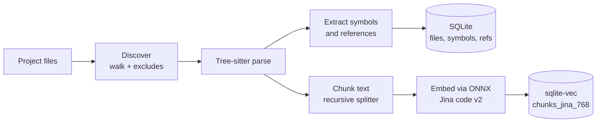
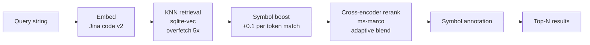
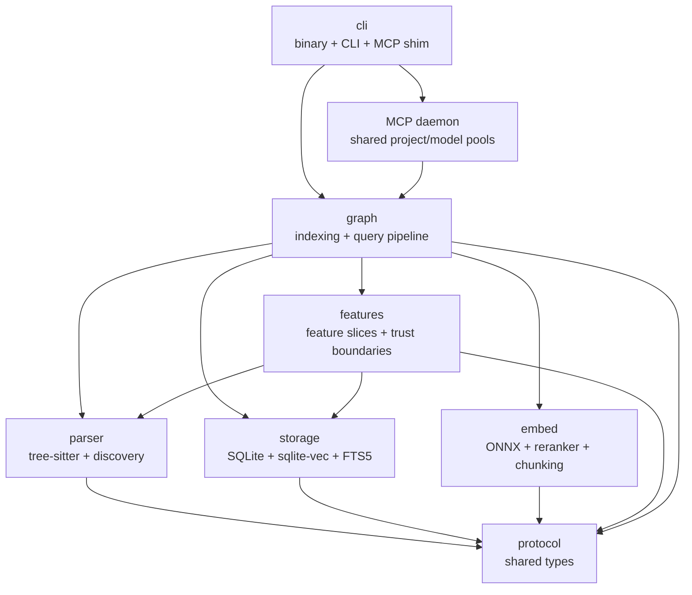

# CodeSage

[](https://github.com/iliaal/codesage/actions/workflows/ci.yml)
[](https://github.com/iliaal/codesage/actions/workflows/tests.yml)
[](https://github.com/iliaal/codesage/actions/workflows/secret-scan.yml)
[](https://github.com/iliaal/codesage/releases)
[](https://opensource.org/licenses/MIT)
[](https://x.com/intent/follow?screen_name=iliaa)


CodeSage is a code intelligence engine for AI coding agents. It combines structural graph queries (symbols, references, dependencies) and semantic search (embedding retrieval with cross-encoder reranking) in a single Rust binary, usable as a CLI or over MCP. Nine languages today (PHP, Python, C, C++, Java, Rust, JavaScript, TypeScript, Go). On the [semble](https://github.com/MinishLab/semble) retrieval corpus, codesage `search` scores **NDCG@10 between 0.68 and 0.93 depending on language**, measured per language across 663 queries (see [External-corpus benchmark](#external-corpus-benchmark-semble) below).

## 🔍 What you can do with it

- Find code by natural-language query: "where does auth happen?", "error handling in the GC".
- Look up symbol definitions by name across a codebase.
- Trace imports, calls, and inheritance for any symbol.
- Map import and include relationships between files.
- Estimate which files a change breaks (change impact analysis).
- Build curated code bundles for LLM consumption in JSON, markdown, or flat-text (gitingest-style) form.
- Read per-file git history: churn, fix ratio, historical co-change, risk score.
- Browse the project as **behavior-keyed feature slices**: each slice bundles an entrypoint + owned files + context files + tests + crossed trust boundaries, mapped deterministically from build manifests and framework routing (Cargo bins, Laravel routes, Flask/FastAPI/Django routes, Express/Fastify/Hono routes, php-src `ext/*`, Next.js `app/**`, CMake/CUDA targets, Python `__main__`, Go `cmd/*`, etc.).
- Inspect **trust boundaries** per file (`network`, `filesystem`, `process-exec`, `secrets`, `database`, `user-input`, `external-api`, `serialization`, `auth`, `concurrency`) derived from imports/includes/calls; same signal folds into `assess_risk` and surfaces as security-review notes when ≥3 boundaries are crossed.
- Expose all of the above over MCP so Claude Code, Codex, or Cursor can call them.

## Capability summary

Concrete answers to the questions a code-intelligence tool earns its keep on. The axes are the ones the broader ecosystem (GitNexus, SocratiCode, code-review-graph, claude-context, repowise) converges on; the right-hand column is what CodeSage actually ships.

| Capability | CodeSage |
|---|---|
| First-call project orientation (languages, freshness, features, top risk, conventions, next calls) | ✓ via `project_overview`, one bounded response |
| Natural-language semantic search | ✓ Jina code embeddings + optional cross-encoder reranker |
| Symbol-level lookup (definitions, references, callers/callees, inheritance) | ✓ tree-sitter, 9 languages, exact line/column ranges |
| File-level dependency mapping (imports / imported-by) | ✓ via `list_dependencies` |
| Change impact / blast-radius analysis | ✓ via `impact_analysis`, configurable depth, symbol or file target |
| Call-flow / "who-touches-X" tracing | ✓ via `find_references` + `impact_analysis` composition |
| Per-file risk score (churn, fix ratio, blast radius, coupling, test gap, cycles, trust boundaries) | ✓ via `assess_risk`, seven-signal blend |
| Patch-level risk aggregation (max/mean, hotspots, test-gap files) | ✓ via `assess_risk_diff`; per-file batch via `assess_risk_batch` |
| Historical co-change / coupling | ✓ via `find_coupling`, decay-weighted with τ=180d |
| Near-clone / structural-similarity detection | ✓ via `find_similar` / `codesage similar`, MinHash over AST shape, identifiers ignored |
| Test-recommendation for a changed file set | ✓ via `recommend_tests`, sibling conventions for 7 frameworks + co-change |
| Pre-commit review prediction (severity-ranked objections for a patch) | ✓ via `review_rehearsal`, composes risk-diff + recommend-tests + drift + feature mapping |
| Curated context bundle for downstream LLM | ✓ via `export_context`, callers + callees optional |
| Session-baseline diff (did this session decay the index?) | ✓ via `session_start` / `session_end`, cycle + risk regressions |
| Cycle / SCC detection in the import graph | ✓ folded into `assess_risk` and `assess_risk_diff.cycles_touching_patch` |
| Feature-slice mapping (behavior-keyed bundles) | ✓ via `codesage map` / `features-list` / `feature-show` / `feature-for`, MCP `list_features` / `find_feature` |
| Curated feature bundle (entry + owned + tests + context for one slice) | ✓ via `codesage feature-bundle <id>` and MCP `feature_bundle` |
| Trust-boundary derivation (network / fs / secrets / process-exec / db / etc.) | ✓ per-file table from imports/includes/calls, aggregated per feature, feeds `assess_risk` |
| Host-agnostic deployment (no Docker, no managed services) | ✓ single static Rust binary + one SQLite file per project |
| Auto-refresh on commit/merge/checkout/rebase | ✓ git hooks installed by `codesage install-hooks` |
| Symbol-level edits (rename, move, replace_symbol_body) | Not supported: read-only by design; pair with Serena or your editor |
| Multimodal ingest (images / audio / video / PDFs) | Not supported: out of scope, code-intel only |
| Cross-repo queries | Not yet: single-project routing today; on the roadmap, not shipped |

## Supported languages

PHP, Python, C, C++, Java, Rust, JavaScript, TypeScript, Go.

## Why a single Rust binary

CodeSage ships as one static Rust binary plus a local SQLite database under `.codesage/` per project. No Docker container, no external vector DB server, no embedding service, and no service manager. CLI commands run directly. MCP clients use `codesage mcp`, a stdio shim that starts or reuses a user-local Unix-socket daemon so concurrent agent sessions share one project cache, embedding model pool, reranker pool, and CUDA context.

The daemon is a same-UID co-trust boundary, not a same-UID isolation boundary. Its socket is private to the Unix user and checks peer credentials, but any process running as that user can ask the daemon to open any onboarded project index. Run untrusted agents under a separate Unix user when project isolation matters. MCP calls are agent-safety capped; CLI commands remain operator tools and can request larger limits or file lists.

The trade-off: CUDA-accelerated embeddings on Linux need the `nvidia-*-cu12` pip packages on the host (see [CUDA setup](#cuda-setup)); on Apple Silicon, set `device = "coreml"` instead (see [CoreML setup](#coreml-setup-macos)). In exchange, install once, run everywhere, no orchestration layer, no systemd unit to manage. Tools in the same category that take the other side of this trade (SocratiCode with managed Qdrant + Ollama, GitNexus with external Qdrant) are valid for different user profiles. If your team already runs Docker Compose for everything, use those. If you want `cargo install`, `codesage init`, and an on-demand local daemon hidden behind stdio MCP, use CodeSage.

## 📊 Benchmarks

Retrieval quality is measured against semble's published corpus. See [External-corpus benchmark](#external-corpus-benchmark-semble) below for the current per-language table and its artifact.

**The git-mined ripgrep and nest figures that stood here were removed on 2026-08-04.** They were measured at codesage 0.4.5, with 16 tagged releases since (`git tag --sort=v:refname`), so they describe a ranker that has been substantially rewritten. Neither corpus is present in `CODESAGE_BENCH_CORPUS_DIR`, so they cannot be re-measured at all. The same applies to the code-review-graph head-to-head that shared those corpora.

One design difference is worth stating as a **hypothesis**, not a result: CodeSage embeds chunks (~50-line regions) rather than individual function bodies, which should suit a commit-style query describing behavior spread across several functions. The measurement that motivated that claim is the one being withdrawn here, so it is untested at the current release.

### External-corpus benchmark (semble)

[semble](https://github.com/MinishLab/semble) ships a published retrieval-evaluation corpus (1,251 queries × 63 repos × 19 languages) with file-level ground truth in `benchmarks/annotations/`. Cleaner than the git-mined "files-changed-in-same-commit" proxy, and an externally-defined target codesage's authors did not write.

Running codesage `search` (`jina-embeddings-v2-base-code` + `ms-marco-MiniLM-L6-v2` reranker, GPU) on the corpus at its pinned SHAs:

Per language, over the 33 repos in the 9 languages codesage parses. CodeSage's column is measured here; semble's and CodeRankEmbed's are their published figures.

| language | **CodeSage** | semble | CodeRankEmbed | repos | queries |
|---|--:|--:|--:|--:|--:|
| javascript | **0.928** | 0.917 | 0.925 | 3 | 60 |
| go | **0.881** | 0.895 | 0.713 | 3 | 58 |
| cpp | **0.876** | 0.915 | 0.897 | 3 | 60 |
| python | **0.865** | 0.867 | 0.878 | 9 | 184 |
| java | **0.850** | 0.849 | 0.790 | 3 | 61 |
| php | **0.839** | 0.858 | 0.847 | 3 | 60 |
| rust | **0.785** | 0.856 | 0.754 | 3 | 60 |
| c | **0.743** | 0.741 | 0.771 | 3 | 60 |
| typescript | **0.682** | 0.706 | 0.671 | 3 | 60 |

Artifact: `bench/history/semble-per-language-2026-08-04-clean.json`. The run reported no skipped repos and no degraded queries; a run with either is not publishable (see below).

**No pooled number is quoted, deliberately.** semble's overall figure covers 63 repos across 19 languages; this covers the 33 repos in the 9 languages codesage parses. Different repo sets are not comparable, so the per-language rows are the only comparable unit. 47% of the corpus targets a language codesage does not parse (588 of 1,251 queries). That is a coverage gap, not a retrieval-quality measurement, and averaging it in would state the wrong thing.

**Weakest rows are TypeScript (0.682) and C (0.743).** Both improved in the current unreleased line and both still trail. TypeScript's residual is `zod`, which ships v3 and v4 side by side and where the remaining confusion is between sibling v4 implementations rather than between versions.

### Why the previously published numbers were withdrawn

This section used to claim `recall@10 = 0.932 / NDCG@10 = 0.788` over 602 queries. Those figures were withdrawn on 2026-08-04 and are not comparable to the table above:

- They were measured across **whole repositories**. semble's `repos.json` carries a `benchmark_root` per repo (29 of the 33 supported repos point at a subdirectory: `monolog` to `src/Monolog`, `curl` to `lib`), and that subdirectory is what their harness indexes. Scoring the whole repo makes the ranker compete against tests, docs and sibling packages the other arms never see.
- The harness scored a **crashed query as 0.000**. `codesage search` could write a complete result set and then abort at teardown; those queries were silently counted as total misses. That alone moved `monolog` from a true 0.8888 to a published 0.8388, and propagated into the PHP row.

Both causes are fixed. The abort is gone from the CLI, and the harness now keeps results from a nonzero exit and reports a `degraded` count per repo and per language, so a crashed run cannot be read as a clean one.

This is **not** a "codesage > semble" claim. A head-to-head would require running semble end-to-end on the same 63 repos under matched conditions, which is out of scope here. The number is codesage measured against semble's published ground truth.

Reproduce the table above with:

```sh
python3 bench/semble-ndcg-runner \
  --corpus ~/.cache/semble-bench \
  --annotations <semble>/benchmarks/annotations \
  --repos <semble>/benchmarks/repos.json \
  --codesage-bin "$PWD/target/release/codesage" \
  --json results.json
```

Index each repo inside its `benchmark_root`, not at the repo root, and pass `--codesage-bin` as an absolute path: each search runs with its cwd set to the corpus repo.

For your own codebase, `bench/codesage-bench-runner <corpus.yaml>` takes a `project_root` plus a `cases` list of `{id, query, expected_files}`. Corpora are not bundled, so private repo names don't leak by accident.

## 🚀 Getting started

```bash
# Build (add --features cuda on Linux for GPU)
cargo build --release -p codesage

# Initialize and index a project
cd /path/to/your/project
codesage init
codesage index

# Search
codesage search "authentication handler"
codesage search --json --limit 20 "database connection pooling"

# Structural queries
codesage find-symbol MyClass
codesage find-references some_function --kind call
codesage dependencies src/main.py

# Change impact analysis (who breaks if you touch this?)
codesage impact DocumentRepository --depth 2 --source-only
codesage impact src/auth/session.ts --json

# Context bundle for LLM consumption
codesage export "authentication flow" --limit 5 --callers
codesage export MyClass --symbol --format md
codesage export "auth flow" --format ingest    # gitingest-style flat-text bundle

# Git history: churn, fix ratio, co-change, risk score
codesage git-index                                          # initial populate; hooks keep it fresh
codesage git-index --full                                   # force full rescan (weekly hygiene)
codesage coupling src/auth/session.ts --limit 5             # files that historically change with this
codesage risk src/auth/session.ts                           # score with decomposition

# MCP for Claude Code / Codex / Cursor (stdio shim starts/reuses one local daemon)
claude mcp add --scope user codesage -- codesage mcp

# Auto-reindex on git operations
codesage install-hooks

# Diagnose installation
codesage doctor
```

## ⚙️ Recipes

Common pipelines using `codesage` with `git`. Each is one shell line and how to read the output.

### Risk check before committing

```bash
git diff --cached --name-only | codesage risk-diff
```

Pipes the staged file list through `assess_risk_diff`. Output shows the max risk score, files in each risk bucket (hotspot, fix-heavy, test-gap, wide blast radius), and paste-ready summary notes for the commit message or PR description. If `max_score >= 0.6` or `test_gap_files` is non-empty, add tests, split the patch, or call it out in the PR description.

### Tests to run after editing

```bash
git diff --cached --name-only | codesage tests-for
```

Returns sibling tests (resolved by language convention) plus tests that historically change with the edited files (from co-change history). Replaces "I'll run all tests" with a focused list.

### Audit a feature branch before opening a PR

```bash
git diff origin/main...HEAD --name-only | codesage risk-diff
```

Same as the pre-commit check, but scoped to everything on the branch instead of just the staged diff. Useful as the last step before `gh pr create`.

### Gate a PR in CI on review objections

```bash
# Fail the job if the patch raises any high-severity review objection.
# Prereq: the index must exist in CI; run `codesage index && codesage git-index`
# in an earlier step, or cache .codesage/ between runs.
git diff --name-only "origin/${GITHUB_BASE_REF:-main}...HEAD" \
  | codesage rehearse --json \
  | jq -e '[.objections[] | select(.severity == "high")] | length == 0' >/dev/null \
  || { echo "::error::review_rehearsal raised high-severity objections"; exit 1; }
```

Runs `review_rehearsal` over the branch diff and fails the job when any objection is `high` severity (missing tests on a high-risk file, blast-radius, hotspot, import cycle, trust-boundary expansion). Drop `--json` to print the full severity-ranked objection list into the CI log so reviewers see the reasoning; the `summary_notes` are paste-ready for the PR description. Tune the gate by widening the `select` to `"high","medium"` for a stricter bar, or key off a specific `.category`.

### What changed in the last week, ranked by risk

```bash
git log --since='1 week ago' --name-only --pretty='' | sort -u | codesage risk-diff --json | jq '.files[] | select(.score >= 0.5) | .file'
```

Lists high-risk files touched in recent history. Good signal during a retrospective or a "where should we focus refactoring?" discussion.

### Which feature slices a branch touched

```bash
codesage features-list --since main --json | jq '.results[] | {id: .feature_id, title}'
```

`--since <ref>` (also on MCP `list_features`) keeps only slices whose entry, owned, or context files changed since the ref, via `git diff <ref>...HEAD`. Scopes a review to the features a branch actually moved instead of the whole map.

### Trifecta for one file

```bash
codesage risk path/to/file.rs
codesage tests-for path/to/file.rs
codesage coupling path/to/file.rs --limit 5
```

When you're about to dive into one specific file. Risk score, suggested tests, and what historically co-changes calibrate caution before you start editing.

### Browse the project as feature slices

```bash
codesage map                                 # populate feature tables
codesage features-list --kind route --json   # all HTTP/router routes
codesage feature-for app/Http/Controllers/UserController.php
codesage feature-show feat_<id> --json       # one slice + its file refs + trust boundaries
codesage feature-bundle feat_<id> --json     # bundle the slice's code for an LLM
```

Use when answering "what slice owns this file?" or "give me the whole flow behind /users". The bundle is the same shape as `export_context` but anchored on the feature's curated file list instead of semantic search results.

### Trust-boundary inspection

```bash
codesage trust-boundaries crates/cli/src/main.rs --json
```

Per-file capability tags (network, filesystem, process-exec, secrets, database, user-input, external-api, serialization, auth, concurrency) derived from imports / includes / calls. The same signal contributes to `assess_risk` and surfaces a "crosses N trust boundaries, security review recommended" note when a file touches three or more.

## 🔌 Agent plugins

`plugins/codesage-tools/` supports Claude Code and Codex from the same package. Both hosts load the `codesage-retrieval` skill for choosing focused semantic, structural, risk, and test-selection calls; Claude additionally ships the task commands. CodeSage keeps MCP registration global, so install that server first with `codesage install codex --global`.

### Claude Code

```bash
claude plugin marketplace add /path/to/codesage
claude plugin install codesage-tools@codesage
/codesage-onboard /path/to/project
```

Slash commands: `/codesage-onboard`, `/codesage-reset`, `/codesage-reindex`, `/codesage-bench`, `/codesage-eval`, and `/codesage-prompt-override`, plus the four feature-slice review commands documented below (`/codesage-review`, `/codesage-triage`, `/codesage-revalidate`, `/codesage-report`). The plugin handles global MCP registration, per-project init, indexing, git hook install (Husky-aware), and writes a `.claude/CLAUDE.md` hint teaching the agent how to route MCP calls. `/codesage-prompt-override` prints a system-prompt fragment that steers Claude Code to prefer CodeSage's MCP tools over Grep for retrieval-shape tasks.

### Codex

Register this repository as a local marketplace, then install the plugin:

```bash
codex plugin marketplace add /path/to/codesage
codex plugin add codesage-tools@codesage
```

When a release is approved for push, `scripts/release.sh` bumps the plugin to the CodeSage release version and reinstalls it before pushing when `codex` is on `PATH`. During local plugin development between releases, update its manifest cachebuster and reinstall it from the same marketplace:

```bash
python3 "${CODEX_HOME:-$HOME/.codex}/skills/.system/plugin-creator/scripts/update_plugin_cachebuster.py" \
  /path/to/codesage/plugins/codesage-tools
codex plugin add codesage-tools@codesage
```

Start a new Codex thread after installation or reinstall so Codex loads the updated skill metadata and instructions.

## 🔍 Feature-slice review

CodeSage maps a project into behavior-keyed feature slices (routes, CLIs, libraries, test suites, jobs). The `codesage-tools` plugin ships a four-command workflow that dispatches read-only subagent reviews (one per slice, in parallel batches) and persists findings to gitignored JSON under `.codesage/findings/`. Each finding gets a stable `fnd_<hex>` ID so it can be referenced in commit messages and PR comments. Re-running keeps prior triage (`status` + audit-trail `history`) intact and merges new defects into the same per-feature file.

The subagent only gets `Read`, `Grep`, and read-only CodeSage MCP tools. The orchestrator batches risk across every owned file and computes a deterministic must-read plan: entry first, changed files next, then the highest-risk owned files. The plan covers at most five files for a normal slice and ten for a risky, trust-heavy, large, or broadly changed slice. The helper rejects responses that don't declare every required path as inspected. CodeSage's core stays read-only; findings are output that other tooling can consume.

The plugin runs evidence validation, identity matching, content-freshness checks, and findings merges through `bin/codesage-review-state`. It accepts exact short two-line code blocks while keeping strict single-line evidence rules, requires both block lines to stay inside the citation window, and reuses a prior ID only when evidence or nearby title and location identify the same defect. Reviewers still handle the code judgment.

### `/codesage-review`

Dispatches subagents in parallel batches over the project's mapped feature slices.

```
/codesage-review <project> [--limit N] [--jobs N] [--feature <id>]
                           [--kind <k>] [--focus all|product]
                           [--severity <s>] [--categories <c,c,...>]
                           [--deep] [--no-verify] [--max-verify-findings N]
                           [--model <m>] [--verify-model <m>]
```

- `<project>`: absolute path to an onboarded codesage project (must contain `.codesage/index.db`)
- `--limit N`: cap the number of features reviewed in one run (default `50`)
- `--jobs N`: parallel subagents per batch (default `4`, hard ceiling `8`)
- `--feature <id>`: review one specific `feat_<hex>`, skipping discovery
- `--kind <k>`: filter features by kind: `route`, `cli-command`, `service`, `library`, `test-suite`, `config`, `job`
- `--focus <all|product>`: default `all`; `product` excludes test-suite slices plus `bench/` and `scripts/` entries for a smaller product-code sweep
- `--severity <s>`: minimum severity to report: `low` / `medium` / `high` (default `medium`)
- `--categories <c,c,...>`: comma-separated list (default `bug,security`); other values include `perf`, `maintainability`
- `--deep`: use correctness, security, and lifecycle lenses on risky or large slices
- `--no-verify`: skip adversarial verification of new findings
- `--max-verify-findings <N>`: cap new findings checked by a feature's single batched verifier (default `5`, maximum `10`)
- `--model <m>` / `--verify-model <m>`: reviewer and verifier model overrides

Each findings document stores a content fingerprint over the feature's entry, owned, context, and test files plus the run's category/severity/focus scope, captured at dispatch time. Review skips a slice only when that fingerprint still matches, so triage edits can't make changed code appear fresh and a widened scope re-reviews unchanged slices; an explicit `--feature` request always re-reviews. Capped runs sort product paths and maximum owned-file risk first; full coverage remains the default.

### `/codesage-triage`

Pure local state edit. Appends a history entry on the named finding and updates its status. No LLM call, no re-review.

```
/codesage-triage <project> --finding <fnd_id> --status <open|false-positive|wont-fix|fixed> [--note <text>]
```

- `--finding <fnd_id>`: the `fnd_<hex>` ID from `.codesage/findings/<feature_id>.json`
- `--status <s>`: new status: `open`, `false-positive`, `wont-fix`, or `fixed`
- `--note <text>`: optional free-form note stored alongside the history entry

### `/codesage-revalidate`

Re-runs the subagent against a specific feature slice (or a single finding's owning slice) and reconciles through the same evidence gate. A missing `open` finding stays open as `needs-confirmation`; omission alone never proves a fix. Current evidence can reopen a user-marked `fixed` finding. `false-positive` and `wont-fix` remain user-owned.

```
/codesage-revalidate <project> --finding <fnd_id> | --feature <feat_id> | --all
                               [--status open|fixed|false-positive|wont-fix]
                               [--max-verify-findings N]
```

- `--feature <id>`: re-review one feature slice
- `--finding <fnd_id>`: re-review the slice that owns this finding (and check whether it's still present)

### `/codesage-report`

Deterministic Markdown render of the findings JSON. No LLM call.

```
/codesage-report <project> [--status <s>] [--severity <s>] [--category <c>] [--feature <id>]
```

- `--status <s,s>`: comma-separated statuses to include (default `open,wont-fix`; `false-positive` and `fixed` excluded unless named)
- `--severity <s>`: minimum severity to render
- `--category <c>`: filter to one category
- `--feature <id>`: render findings for a single feature

### State paths

| Path | Content |
|---|---|
| `.codesage/findings/<feature_id>.json` | Feature metadata + content fingerprint + findings + transition-only audit-trail `history[]` |
| `.codesage/findings/history/<feature_id>-<run_id>.json` | Per-run snapshot of the feature's findings, never modified after write |
| `.codesage/reviews/<run_id>.json` | Run record: filters used, features planned, completion stats by severity/category, top features by finding count, severity-high list |

Both directories are gitignored automatically. `codesage init` (run during `/codesage-onboard`) writes `.codesage/.gitignore` containing `*`, so the whole `.codesage/` tree stays out of version control.

### Example workflow

```bash
# Initial sweep over every mapped feature
/codesage-review /path/to/project

# Smaller sweep over product code only
/codesage-review /path/to/project --focus product

# Look at the result
/codesage-report /path/to/project

# Triage a false positive
/codesage-triage /path/to/project --finding fnd_b3a1c4e7 --status false-positive --note "regex is anchored, not exploitable"

# Fix a real bug, then re-check
$EDITOR src/server.ts
/codesage-revalidate /path/to/project --finding fnd_9c80fa62
```

## Indexing pipeline

`codesage index` walks the project, parses every supported file, extracts structural data and embeddings, and writes both into the same SQLite database.


```mermaid
flowchart LR
    A[Project files] --> B[Discover<br/>walk + excludes]
    B --> C[Tree-sitter parse]
    C --> D[Extract symbols<br/>and references]
    C --> E[Chunk text<br/>recursive splitter]
    D --> F[(SQLite<br/>files, symbols, refs)]
    E --> G[Embed via ONNX<br/>Jina code v2]
    G --> H[(sqlite-vec<br/>chunks_jina_768)]
```

Parsing happens in parallel via Rayon; SQLite writes are batched. Re-running `codesage index` is incremental: only files whose content hash changed are re-parsed and re-embedded.

## Search pipeline

A query flows through seven stages:


```mermaid
flowchart LR
    Q[Query string] --> E[Embed<br/>Jina code v2]
    E --> K[KNN retrieval<br/>sqlite-vec<br/>overfetch 5x]
    K --> B[Symbol boost<br/>+0.1 per token match]
    B --> R[Cross-encoder rerank<br/>ms-marco<br/>adaptive blend]
    R --> A[Symbol annotation]
    A --> T[Top-N results]
```

1. Embed the query with Jina embeddings v2 base-code (768d) via ONNX Runtime. Chunks carry file path and symbol context, prepended before they were embedded at index time.
2. Retrieve nearest neighbours from sqlite-vec, overfetching 5x when the reranker is active.
3. For code-literal queries only (backticks, `::`, glob patterns, or a rare indexed token), merge BM25 candidates by reciprocal rank fusion. Most queries skip this.
4. Boost chunks whose content matches known symbol names, then apply definition, path, version and saturation adjustments.
5. Re-score with ms-marco-MiniLM-L6-v2 and blend with the semantic score. The weight adapts to query shape: 0.35 for a bare identifier, 0.6 for natural language, 0.5 otherwise. Skipped when BM25 fusion ran, since the rare-token match is already the stronger signal there.
6. Annotate each result with overlapping function and class names.
7. Truncate to the requested limit.

The reranker is optional. Set or remove it in `config.toml`; every other stage still runs without it.

## Configuration

`codesage init` generates `.codesage/config.toml`:

```toml
[project]
name = "my-project"

[embedding]
model = "jinaai/jina-embeddings-v2-base-code"
device = "gpu"                                        # "cpu", "gpu", or "coreml" (macOS)
reranker = "cross-encoder/ms-marco-MiniLM-L6-v2"     # optional, remove to disable
# batch_size = 64                                    # optional; defaults to 64, or 10 on Apple

[index]
exclude_patterns = [
  "**/tests/**", "**/vendor/**", "**/node_modules/**",
  "**/*.test.ts", "**/*Test.php", "**/*.phpt",
]
```

Models download from HuggingFace the first time you use them.

## CUDA setup

ONNX Runtime loads dynamically. CUDA libraries come from pip-installed `nvidia-*-cu12` packages. At first use, the binary discovers them via `CODESAGE_NVIDIA_LIBS`, Python `site-packages`, or standard system paths. `ORT_DYLIB_PATH` can override the ONNX Runtime library location.

Build with GPU support: `cargo build --release -p codesage --features cuda`. Set `device = "gpu"` in config. `codesage doctor` reports how many nvidia lib dirs were discovered.

If CUDA is requested but fails to register, the process errors out instead of falling back to CPU.

Required pip packages: `onnxruntime-gpu`, `nvidia-cudnn-cu12`, `nvidia-cublas-cu12`, `nvidia-cuda-runtime-cu12`, `nvidia-cufft-cu12`, `nvidia-curand-cu12`, `nvidia-cuda-nvrtc-cu12`.

## CoreML setup (macOS)

On Apple Silicon, set `device = "coreml"` in `.codesage/config.toml`. macOS builds statically link ONNX Runtime with the CoreML execution provider at compile time (no pip `onnxruntime` dylib, no extra Cargo feature). Linux/CUDA builds keep the `load-dynamic` path.

```bash
cargo build --release -p codesage
codesage doctor    # includes a coreml readiness check
codesage index
```

First session creation compiles CoreML submodels and can take a few minutes; subsequent inference in the same process is faster. Large models (e.g. `jinaai/jina-embeddings-v2-base-code`) may need smaller batches under memory pressure. Apple targets default to batch size 10; set `[embedding].batch_size`, `CODESAGE_BATCH_SIZE`, or run `codesage index --batch-size <N>` to lower it further for one index run.

For verbose progress during a long first index: `RUST_LOG=codesage=info codesage index --verbose`.

If CoreML registration fails, the process errors out instead of silently falling back to CPU.

## 🏗️ Architecture

A Rust workspace with seven crates:


```mermaid
flowchart TD
    cli[cli<br/>binary + CLI + MCP shim]
    daemon[MCP daemon<br/>shared project/model pools]
    gr[graph<br/>indexing + query pipeline]
    parser[parser<br/>tree-sitter + discovery]
    storage[storage<br/>SQLite + sqlite-vec + FTS5]
    embed[embed<br/>ONNX + reranker + chunking]
    feat[features<br/>feature slices + trust boundaries]
    protocol[protocol<br/>shared types]

    cli --> daemon
    cli --> gr
    daemon --> gr
    gr --> parser
    gr --> storage
    gr --> embed
    gr --> feat
    feat --> parser
    feat --> storage
    parser --> protocol
    storage --> protocol
    embed --> protocol
    feat --> protocol
    gr --> protocol
```

| Crate | Role |
|-------|------|
| `protocol` | Shared types (Symbol, Reference, SearchResult) |
| `parser` | File discovery, tree-sitter parsing, symbol and reference extraction |
| `storage` | SQLite with sqlite-vec KNN and FTS5 |
| `embed` | ONNX embedding inference, cross-encoder reranking, chunking |
| `features` | Feature-slice mapping and trust-boundary derivation |
| `graph` | Indexing orchestration and search pipeline |
| `cli` | Binary with CLI subcommands, stdio MCP shim, and Unix-socket MCP daemon |

Storage is a single SQLite database per project at `.codesage/index.db`: structural tables (symbols, refs, files) plus model-specific vector tables for embeddings.

## Retrieval benchmarks

`bench/` holds the harness:

- `codesage-bench-runner` runs a YAML corpus of ground-truth cases through `codesage search` and reports miss rate, median first-hit, recall@5, and recall@10.
- `extract-eval-cases.py` mines eval cases from Claude Code session transcripts and git commit history.

Corpora aren't bundled. Bring your own, or point the plugin at `$CODESAGE_BENCH_CORPUS_DIR`.

## ⚠️ Known limitations

Honest inventory of what CodeSage does not do well, measured on our canary corpora and from 30 days of real Claude Code session logs (the harness in `bench/analyze-codesage-quality.py` produces the same numbers locally).

**Language surface is narrower than competitors'.** Nine languages today (Java added after C++ in 0.4.5). Graphify ships 25, SocratiCode 18+, and code-review-graph more than CodeSage (its README no longer states an exact count). The gap matters most if your stack is Ruby, Kotlin, Swift, or Scala. Measured cost: on the semble retrieval corpus (1,251 queries × 63 repos × 19 languages), 47% of queries target a language codesage does not parse (588 of 1,251), with zero recall on those. The tree-sitter query files live under `crates/parser/src/queries/` and contributions there are the cleanest way to extend coverage.

**Retrieval misses on cross-file refactor queries.** The failure mode is a commit subject like *printer: drop dependency on serde_derive* that describes a rename spanning several files with no distinctive literal to match on. Single-identifier lookups (`find_symbol`, `find_references`) are reliable. Pure semantic searches (`search`) are reliable. Diffuse multi-file refactor descriptions expressed in prose are the failure mode.

**`impact_analysis` biases toward over-prediction.** The tool walks reference edges up to a configurable depth and reports every reachable file. Agents get false positives but almost never false negatives (short of a stale index). We picked that side of the precision/recall trade because an agent can filter a list of 20 candidates faster than it can recover from a missed dependency that bites in review. If you want high precision at the cost of recall, drop `--depth` to 1 and `--source-only`.

**MCP tool-selection rate is low today.** When CodeSage MCP tools are available in a Claude Code session alongside `Grep`, the agent picks `Grep` on code-identifier queries: 1.1% CodeSage-pick rate over 30 days of sessions, 0/10 on a controlled active harness (measured 2026-04-24, not re-measured since). We sharpened tool descriptions and per-project CLAUDE.md guidance to call this out; the next measurement cycle will show whether the intervention landed. For a hook-level workaround today, see the LSP enforcement kit in the [Complementary tools](#complementary-tools) section.

**`find_coupling` returns empty on young files.** Each empty result now carries a `note` field (`"no commits tracked"`, `"below min-count=3 threshold"`, `"path shape mismatch"`) so the agent can tell the cause. The underlying data just doesn't exist for recently-added files; the tool reports that honestly instead of inventing signal.

## 🔗 Pairs with

- **[whetstone](https://github.com/iliaal/whetstone)**: agents, commands, and skills that tell coding agents *how* to work. CodeSage is the intelligence layer (what the code is); whetstone is the discipline layer (how to investigate, review, and ship). Install both for the full stack.

## Complementary tools

These address different layers than CodeSage and work well alongside it:

- **[rtk](https://github.com/rtk-ai/rtk)**: static compression proxy for noisy CLI output (`git diff`, `pytest`, `cargo build`). Different layer than CodeSage: CodeSage narrows *what the agent reads* for code questions, rtk compresses *how much it reads* for command output. Token-reduction claims from the two tools are additive, not overlapping; measure them separately when quoting.
- **[claude-code-lsp-enforcement-kit](https://github.com/nesaminua/claude-code-lsp-enforcement-kit)**: hook pack that blocks `Grep` on code-symbol patterns and steers agents toward LSP / MCP tool calls. Provider-agnostic; auto-detects CodeSage's MCP alongside cclsp and Serena. Worth pairing if your tool-selection-rate numbers (see `bench/analyze-codesage-quality.py`) stay low after description-level interventions.

## Contributing

See [CONTRIBUTING.md](CONTRIBUTING.md). In short: file an issue first, add a test, update `CHANGELOG.md` under `[Unreleased]` for user-visible changes.

## License

MIT

---

[Follow @iliaa on X](https://x.com/iliaa) • [Blog](https://ilia.ws) • If this gave your AI agent a real model of your code, ⭐ star it!
